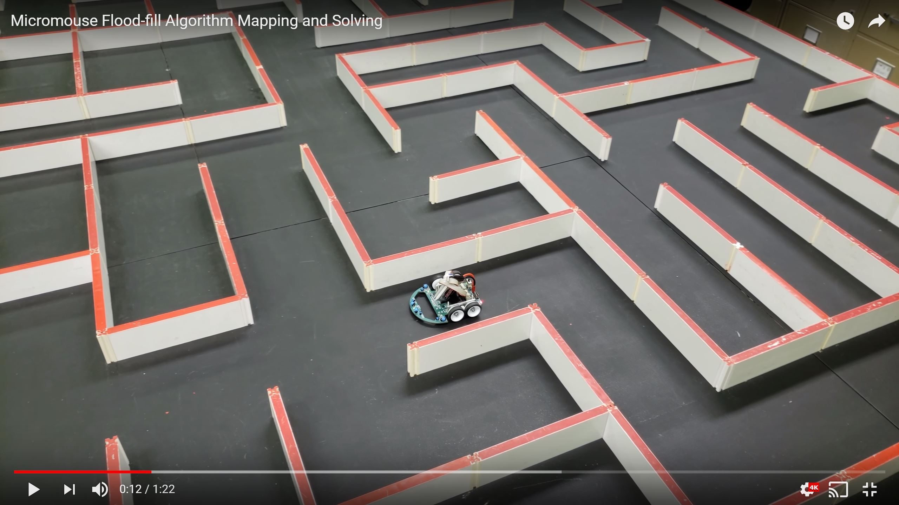
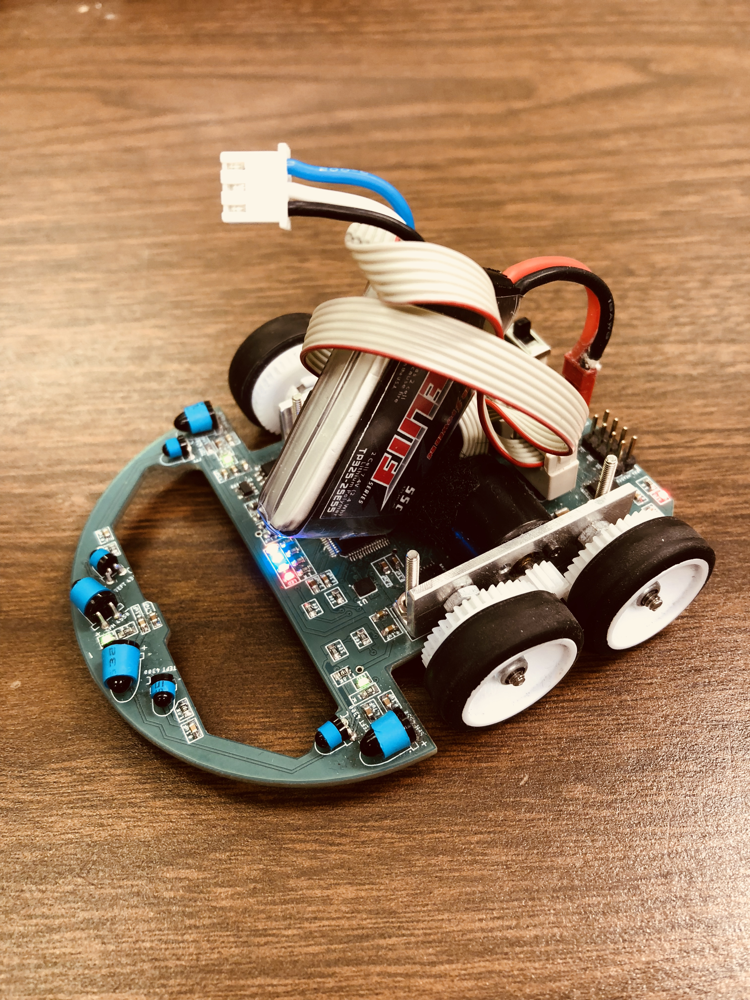

# Micromouse

``` 
Demo video. Floodfill mapping and solving
```

[](https://www.youtube.com/watch?v=v6TXTJd9zPE&feature=youtu.be "Micromouse Floodfill algorithm - Click to Watch!")


A Micromouse is a small robotic vehicle designed to navigate its way through an unknown maze. It is an autonomous, battery-operated, and self-contained robot that utilizes maze-solving algorithms to find the optimal route with the shortest run time to the center of the maze. The main challenge is to equip the electro-mechanical device with adaptive intelligence which enables the exploration of different maze configurations. In addition, the mouse must reliability navigate through the maze at accelerated speeds without crashing into the maze walls. The three main subsystems consist of the drive system, control system, and sensors. The drive system includes a mechanical chassis, a set of motors, gears, and wheels which enables the mouse to maneuver within the constraints of the maze. The control system utilizes a maze-solving algorithm based on sensor readings to calculate the fastest possible path. The final subsystem is the sensors which relays the current state of the surroundings and assists in wall detection. By combining these components, an autonomous mouse capable of navigating through a maze was designed, built, and programmed. 



# Developers Guide
## Environment Setup
The various software and components needed to program the board are as follows:
- Eclipse (IDE)
- STM32 ST-LINK Utility (Used to upload .hex file onto board)
- STM32CubeMX (Generate configuration settings/pins)
- STMStudio (Debugger)

* Set up the Eclipse/GCC and STM32 toolchain/compiler by following this [environment tutorial](https://www.carminenoviello.com/2014/12/28/setting-gcceclipse-toolchain-stm32nucleo-part-1/)
* Import STM32CubeMX pin configurations into Eclipse project using the [import/script tutorial](https://www.carminenoviello.com/2015/11/02/quickly-import-stm32cubemx-project-eclipse-project/)

## Programming the Board
In Eclipse, generate the .hex file with Project -> Build All. Open ST-LINK and connect to the board (Target -> Connect). Next, open the .hex file by going to the project folder and open the Micromouse.hex file in the Debug folder. Finally, program the board by Target -> Program. 

IMPORTANT: Always open file each time is it rebuilt since it always uses the old file and does not auto refresh the new .hex file.

## Debugging
Oepn STMStudio and create new variable in the "Display Variables Settings" section. To get the address of the variable to be monitored, go to the Debug folder and open the Micromouse.map file. Find the variable name and type into the STMStudio program. Send the variable to varViewer and connect the board to the program. 

IMPORTANT: Only global variables can be monitored using this utility. Between the STMStudio and the ST-LINK utility, only one can be connected to the board at a time. 

## Generate configuration pins
Open STM32CubeMX and add the pins according to the schematic. Then Project -> Generate Code to generate the code. 

WARNING: When the code is generated, it will replacd everything inside the specified destination folder. Use the "Cube" branch to generate new code and use git diff to see what was changed. 

## Debugging branches
`cube` - When generating new CubeMX pin configurations use this branch then `git diff` with current branch
`ADC_calibration` - When testing ADC values, open up STMStudio 
`gyro_encoder_cal` - Branch for testing gyro or encoder values
`diagonals` - For testing wall tracking tracking 
